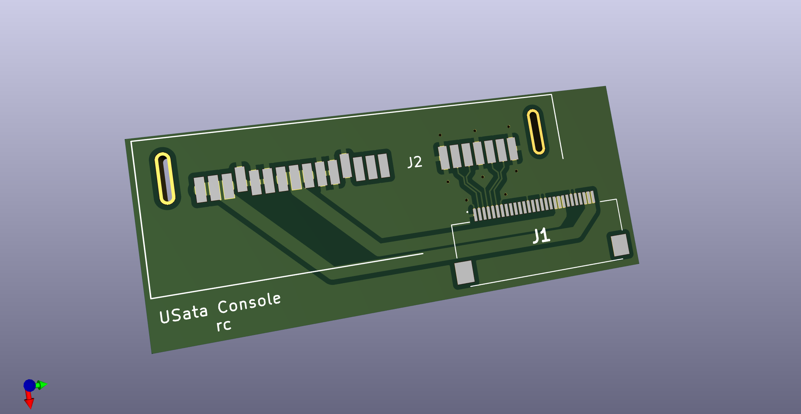

# usata - connect HDDs and SSDs to your Wii U

usata allows you to remove the optical drive from your Wii U and replace it with a hard drive or
solid-state drive. Combined with [MLC rebuilding tech][mlc-rebuild] you can have up to 2TB of fast,
internal storage. The drive also shows up and is usable in [linux-wiiu][linux-wiiu].

[mlc-rebuild]: https://gbatemp.net/threads/how-to-upgrading-rebuilding-wii-u-internal-memory-mlc.636309/
[linux-wiiu]: https://gitlab.com/linux-wiiu/linux-wiiu

## Limitations

Your drive must stay within the power limits of the original optical drive - 1.8A@12V, 1A@5V. 3.3V is not
connected to maximise compatibility with drives using [PWDIS][pwdis]. Since I'm not an expert electrical
engineer, the board might not be capable of carrying full power - I would stick to laptop drives or SSDs
rather than full-sized spinning disks. If you know how to check the current capacity of the board, please
let me know if it's up to scratch!

[pwdis]: https://en.wikipedia.org/wiki/SATA#Power_connectors

## Manufacturing

I have successfully gotten boards made by PCBWay and JLCPCB in the past. The parts used are the
[TE Connectivity 2023246-2](https://www.te.com/usa-en/product-2023246-2.html) and the
[Hirose FH28K-28S-0.5SH](https://www.hirose.com/en/product/p/CL0586-1880-0-00).

You're welcome to make this board, sell it, and remix it as allowed under the license - gerbers are
available in the releases section. If you're leaving my name and URL on it, please make sure the version
number on the board matches a release.

## Contributions

I'm no expert in PCB design or assembly but I tried my best here. Feel free to file an issue with your
thoughts or file a pull request with your improvements.

## License

This work is licensed under a
[Creative Commons Attribution-ShareAlike 4.0 International License][cc-by-sa].

[![CC BY-SA 4.0][cc-by-sa-image]][cc-by-sa]

[cc-by-sa]: http://creativecommons.org/licenses/by-sa/4.0/
[cc-by-sa-image]: https://licensebuttons.net/l/by-sa/4.0/88x31.png

Note that I am happy to accept attribution on a website, git repo, forum post, documentation etc.
rather than on the derivative board itself.
